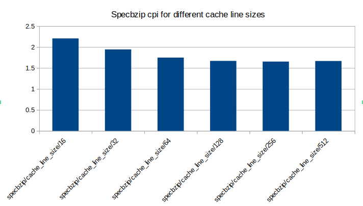
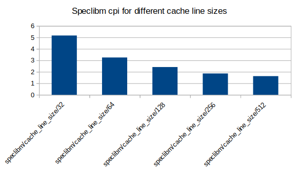

# Αρχιτεκτονική Υπολογιστών Εργαστήριο 2

Ομάδα 3 

* Φίλιππος Τόλιας 10252
* Χρήστος-Μάριος Περδίκης 10075

### Βήμα 1ο

#### 1. Χρησιμοποιήστε τις γνώσεις σας από το πρώτο εργαστήριο και βρείτε στα σχετικά αρχεία τις βασικές παραμέτρους για τον επεξεργαστή που εξομοιώνει ο gem5 όσον αφορά το υποσύστημα μνήμης. Πιο συγκεκριμένα, βρείτε τα μεγέθη των caches (L1 instruction και L1 data caches καθώς και της L2 cache), το associativity κάθε μίας από αυτές και το μέγεθος της cache line.

Aφού δεν ορίζουμε εμείς κάποια συγκεκριμένη τιμή για το υποσύστημα μνήμης του επεξεργαστή, θα γίνει χρήση των προεπιλεγμένων τιμών από το gem5. Αυτές τις
βρίσκουμε στο αρχείο config/common/Options.py και βλέπουμε:

* `L1d cache size = 64kB`

* `L1i cache size = 32kB`

* `L2 cache size = 2MB`

* `L1d associativity = 2`

* `L1i associativity = 2`

* `L2 associativity = 8`

* `Cache line size = 64`

#### 2. Καταγράψτε τα αποτελέσματα από τα διαφορετικά benchmarks. Συγκεκριμένα κρατείστε τις ακόλουθες πληροφορίες από κάθε benchmark: (i) χρόνο εκτέλεσης (προσοχή! Το χρόνο που απαιτεί το πρόγραμμα να τρέξει στον εξομοιούμενο επεξεργαστή, όχι τον χρόνο που χρειάζεται ο gem5 να πραγματοποιήσει την εξομοίωση), (ii) CPI (cycles per instruction) και (iii) συνολικά miss rates για την L1 Data cache, L1 Instruction cache και L2 cache. Τις πληροφορίες αυτές μπορείτε να τις αντλήσετε από τα αρχεία stats.txt (Hint: για το πρώτο βρείτε την τιμή sim_seconds και για το τρίτο αναζητήστε εγγραφές σαν αυτή: icache.overall_miss_rate::total). Φτιάξτε γραφήματα που να απεικονίζουν αυτές τις πληροφορίες για το σύνολο των benchmarks. Τι παρατηρείτε;

|         | Specbzip | Specmcf | Spechmmer | Specsjeng | Speclibm |
| ------- | -------  | ------- | -------   | -------   | -------  |
| simSeconds | 0.087389 | 0.068169 | 0.064248 | 0.184545 | 0.162483 |
| CPI | 1.747783 | 1.363381 | 1.284963 | 3.690893 | 3.249665 |
| L1d total miss rate | 0.014272 | 0.003376 | 0.001865 | 0.244528 | 0.061731 |
| L1i total miss rate | 0.000061 | 0.014607 | 0.000181 | 0.016750 | 0.000088 |
| L2 total miss rate | 0.272277 | 0.158090 | 0.073000 | 0.065054 | 0.999979 |

Παρατηρούμε ότι τα benchmarks specsjeng και speclibm χρειάζονται παραπάνω χρόνο για να εκτελεστούν, έχουν μεγαλύτερο CPI, άρα χειρότερο performance και 
πιστεύουμε ότι αυτά οφείλονται στο ότι έχουν πολλά παραπάνω cache misses από τα υπόλοιπα 3 benchmarks σε όλες τις caches.

#### 3. Τρέξτε ξανά τα benchmarks στον gem5 με τον ίδιο τρόπο με προηγουμένως αλλά αυτή τη φορά προσθέστε και την παράμετρο --cpu-clock=1GHz και --cpu-clock=3GHz. Δείτε τα αρχεία stats.txt από τις τρεις εκτελέσεις του προγράμματος (την αρχική σας και αυτή με το 1GHz και το 3GHz) και εντοπίστε τις πληροφορίες για το ρολόι. Θα βρείτε δύο εισαγωγές: μία για system.clk_domain.clock και μία για cpu_cluster.clk_domain.clock. Μπορείτε να εξηγήσετε τελικά τί χρονίζεται στο 1GHz/3GHz και τί χρονίζεται στα default GHz; Γιατί πιστεύετε συμβαίνει αυτό?  Ανατρέξτε στο αρχείο config.json που αντιστοιχεί στο σύστημα με το 1GHz. Αναζητώντας πληροφορίες για το ρολόι, μπορείτε να δώσετε μια πιο σαφή απάντηση; Αν προσθέσουμε άλλον έναν επεξεργαστή, ποια εικάζετε ότι θα είναι η συχνότητα του; Παρατηρείστε τους χρόνους εκτέλεσης των benchmarks για τα συστήματα με διαφορετικό ρολόι. Υπάρχει τέλειο scaling; Μπορείτε να δώσετε μια εξήγηση αν δεν υπάρχει τέλειο scaling;

default:

* `system.clk_domain.clock = 1000`

* `system.cpu.clk_domain.clock = 500`

1GHz:

* `system.clk_domain.clock = 1000`

* `system.cpu.clk_domain.clock = 1000`

3GHz:

* `system.clk_domain.clock = 1000`

* `system.cpu.clk_domain.clock = 333`

Βλέπουμε ότι υπάρχουν δύο τιμές που αναφέρονται σε clock. Το `system.clk_domain.clock` αναφέρεται στο clock του συστήματος, το ίδιο clock που χρησιμοποιείται από όλες τις μνήμες, τα buses,
κλπ για να είναι όλα συγχρονισμένα μεταξύ τους. Το `system.cpu.clk_domain.clock` είναι το clock που χρησιμοποιείται εσωτερικά από τον επεξεργαστή μας και είναι διαφορετικό του 
system clock, αλλά παραμένει συγχρονισμένο μαζί του. Ουσιαστικά θέσαμε το clock του επεξεργαστή μας να είναι πιο γρήγορο, αλλά το clock του συστήματος παρέμεινε σταθερό στο default value. 
Υπάρχουν δυο διαφορετικά clocks γιατί υπάρχει περίπτωση ο επεξεργαστής να χρειάζεται να εκτελεί περισσότερα (καμιά φορά ίσως και λιγότερα) operations από το υπόλοιπο σύστημα. 

Επιβεβαίωση για τη θεωρία μας βλέπουμε στο αρχείο config.json. Στην κυρίως μνήμη και το bus προς τη κυρία μνήμη βλέπουμε `"clk_domain": "system.clk_domain"`, ενώ στις caches, στα bus των
caches και σε άλλα εξαρτήματα εσωτερικά του επεξεργαστή βλέπουμε `"clk_domain": "system.cpu_clk_domain".

Εικάζουμε ότι ένας νέος επεξεργαστής θα είχε το default cpu clock, δηλαδή 2GHz, καθώς υπάρχει περίπτωση να υπάρχει στη ίδιο motherboard δύο επεξεργαστές με διαφορετικές συχνότητες (πχ smartphones).

|                      | 2GHz (default) | 1GHz | 3GHz |
| -------------------- | -------------  | ---- | ---- |
| Specbzip simSeconds  | 0.087389 | 0.165223 | 0.061595 |
| Specmcf simSeconds   | 0.068169 | 0.132593 | 0.046799 |
| Spechmmer simSeconds | 0.064248 | 0.128175 | 0.042898 |
| Specsjeng simSeconds | 0.184545 | 0.329172 | 0.138285 |
| Speclibm simSeconds  | 0.162483 | 0.246976 | 0.135953 |

`Specbzip 3GHz/1GHz -> 0.165223/0.061595 = 2.68, 3GHz/2GHz -> 0.087389/0.061595 = 1.42, 2GHz/1GHz -> 0.165223/0.087389 = 1.89`, άρα οι τιμές κάνουν περίπου scale, αλλά όχι ακριβώς
`Specmcf 3GHz/1GHz -> 0.0132593/0.046799 = 2.83, 3GHz/2GHz -> 0.068169/0.042898 = 1.46, 2GHz/1GHz -> 0.132593/0.068169 =  1.94`. Οι τιμές είναι πολύ πιο κοντά στο να κάνουν τέλεια scale από specbzip, αλλά ακόμα δεν είναι τέλεια η αναλογία
`Spechmmer 3GHz/1GHz -> 0.128175/0.042898 = 2.987, 3GHz/2GHz -> 1.497 , 2GHz/1GHz -> 1.995`. Σε αυτό το benchmark μπορούμε να πούμε ότι ο χρόνος εκτέλεσης κάνει τέλεια scale με το cpu clock
`Specsjeng 3GHz/1GHz -> 0.329172/0.138285 = 2.38, 3GHz/2GHz -> 0.184545/0.138285 = 1.33, 2GHz/1GHz -> 0.329172/0.184545 = 1.78`. Οι τιμές έχουν αρχίσει να αποκλίνουν, δεν κάνει scale τόσο καλά αυτό το benchmark.
`Speclibm 3GHz/1GHz -> 0.246976/0.135953 = 1.82, 3GHz/2GHz -> 0.162483/0.135953 = 1.19, 2GHz/1GHz -> 0.246976/0.162483 = 1.52`. Είναι προφανές ότι οι τιμές δεν κάνουν scale εδώ.

Βλέπουμε ότι ενώ οι χρόνοι εκτέλεσης των δύο πρώτων benchmarks κάνουν scale περίπου, οι χρόνοι του spechmmer κάνουν scale τέλεια και οι χρόνοι των specsjeng και speclibm δεν κάνουν scale. Αυτό συμβαίνει διότι σε αυτά τα δύο benchmarks υπάρχουν πολλά
cache misses ειδικά στην L2, άρα ο χρόνος του προγράμματος δεν επηρεάζεται τόσο από την ταχύτητα του επεξεργαστή.

#### 4. Τρέξτε ξανά ένα benchmarks το οποίο θα επιλέξετε εσείς στον gem5 με τον ίδιο τρόπο με προηγουμένως αλλά αυτή τη φορά αλλάξτε το memory configuration από DDR3_1600_x64 στο DDR3_2133_x64 (DDR3 με πιο γρήγορο clock) και . Τι παρατηρείτε? Εξηγήστε τα ευρήματά σας.

Αποτελέσματα για το speclibm benchmark:

|                     | DDR3_1600_8x8 | DDR3_2133_8x8 |
| ------------------- | ------------- | ------------- |
| simSeconds          | 0.162483      | 0.15888       |
| CPI                 | 3.249665      | 3.177646      |
| L1d total miss rate | 0.061731      | 0.061731      |
| L1i total miss rate | 0.000088      | 0.000088      |
| L2 total miss rate  | 0.999979      | 0.999979      |

Αυτό που παρατηρούμε είναι ότι το σύστημα με την πιο γρήγορη RAM έχει μικρότερο `simSeconds` και `CPI` δηλαδή είναι πιο γρήγορο. Επίσης παρατηρούμε ότι τα `cache miss rate` παραμένουν ίδια. Βλέπουμε ότι δεν έχουμε μεγάλη βελτίωση στο performance διότι έχουμε πολύ μικρό L1 cache miss rate, άρα παρόλο που έχουμε πιο γρήγορη κύρια μνήμη, χρησιμοποιείται μόνο λίγες φορές.

### Βήμα 2ο

* Simulations για μέγεθος cache size:

Για αυτή και για τις επόμενες προσομοιώσεις αλλάζουμε μία μεταβλητή σταδιακά όσο κρατάμε τις υπόλοιπες στα default values που βρήκαμε στο βήμα 1ο, ερώτημα 1. Με αυτό τον τρόπο θα αποφασίσουμε ποιά τιμή για κάθε μία από τις μεταβλητές είναι καλύτερη λαμβάνοντας υπόψιν μας όλα τα benchmarks.

Στον ακόλουθο πίνακα φαίνονται τα cpi με βάση ποιο benchmark εκτελέστηκε και τι μέγεθος cache line χρησιμοποιήθηκε.

|                        | specbzip | spechmmer | specmcf  | specsjeng | speclibm |
| ---------------------- | -------- | --------- | -------  | --------- | -------- |
| Cache Line Size = 16   | 2.205129 | 1.323281  | 1.707885 | 11.919209 | 8.872846 |
| Cache Line Size = 32   | 1.942362 | 1.306230  | 1.440472 | 6.417796  | 5.164871 |
| Cache Line Size = 64   | 1.747783 | 1.284963  | 1.363381 | 3.690893  | 3.249665 |
| Cache Line Size = 128  | 1.669584 | 1.282548  | 1.352544 | 3.742715  | 2.418008 |
| Cache Line Size = 256  | 1.652862 | 1.292462  | 1.489060 | 6.326712  | 1.857574 |
| Cache Line Size = 512  | 1.667016 | 1.287083  | 1.631418 | 4.907774  | 1.626793 |

Βλέπουμε ότι όσο αυξάνουμε το μέγεθος cache line, η απόδοση των benchmarks specsjeng, speclibm βελτιώνεται δραματικά, στο specbzip βελτιώνεται εώς ότου το μέγεθος του cache line φτάσει 128, στο specmcf η βέλτιστη τιμή για το μέγεθος cache line είναι 64, και στο spechmmer υπάρχει πολύ μικρή αλλαγή στην απόδοση για οποιαδήποτε τιμή.
Τα benchmarks με τη μεγαλύτερη τοπικότητα θα επωφελούνται περισσότερο με όλο και πιο μεγάλο μέγεθος cache line (specsjeng, speclibm). Παρόλα αυτά, αν αυξηθεί υπερβολικά το μέγεθος cache line, τότε θα είναι πολύ χρονοβόρα η ενημέρωση της μνήμης cache από την κύρια μνήμη και η απόδοση του προγράμματος θα πέσει πάλι. Αυτό το φαινόμενο 
παρατηρούμε στο specmcf.

* Simulations για L2 associativity: 

Στον ακόλουθο πίνακα φαίνονται τα cpi με βάση ποιο benchmark εκτελέστηκε και τι L2 associativity χρησιμοποιήθηκε.

|                        | specbzip | spechmmer | specmcf  | specsjeng | speclibm |
| ---------------------- | -------- | --------- | -------  | --------- | -------- |
| L2 associativity = 1     | 1.775623 | 1.284963  | 1.365719 | 3.692434  | 3.249665 |
| L2 associativity = 2     | 1.755510 | 1.284963  | 1.363415 | 3.691352  | 3.249665 |
| L2 associativity = 4     | 1.748091 | 1.284963  | 1.363381 | 3.690778  | 3.249665 |
| L2 associativity = 8     | 1.747783 | 1.284963  | 1.363381 | 3.690893  | 3.249665 |
| L2 associativity = 16    | 1.747364 | 1.284963  | 1.363169 | 3.690885  | 3.249665 |
| L2 associativity = 32    | 1.747415 | 1.284963  | 1.362966 | 3.689484  | 3.249667 |
| L2 associativity = 64    | 1.747852 | 1.284963  | 1.362432 | 3.688949  | 3.249665 |
| L2 associativity = 128   | 1.747696 | 1.284963  | 1.362108 | 3.688713  | 3.249667 |

Βλέπουμε ότι από τις τιμές που δοκιμάσαμε καμία δεν αλλάζει σημαντικά την απόδοση οποιουδήποτε benchmark. Η μεγαλύτερη μεταβολή που βλέπουμε είναι στο specbzip benchmark με μια βελτίωση περίπου 0.03 cpi όταν το L2 associativity αυξάνεται από 1 σε 4.

* Simulations για L2 size:

Στον ακόλουθο πίνακα φαίνονται τα cpi με βάση ποιο benchmark εκτελέστηκε και τι μέγεθος L2 cache χρησιμοποιήθηκε.

|                        | specbzip | spechmmer | specmcf  | specsjeng | speclibm |
| ---------------------- | -------- | --------- | -------  | --------- | -------- |
| L2 size = 32kB  | 2.302183 | 1.358482  | 1.384959 | 3.870465  | 3.222650 |
| L2 size = 64kB  | 2.236785 | 1.339581  | 1.384352 | 3.748503  | 3.252973 |
| L2 size = 128kB | 2.152640 | 1.303462  | 1.381896 | 3.706021  | 3.253288 |
| L2 size = 256kB | 2.015374 | 1.285506  | 1.375519 | 3.694426  | 3.252796 |
| L2 size = 512kB | 1.881470 | 1.284963  | 1.373081 | 3.690907  | 3.252315 |
| L2 size = 1MB   | 1.802197 | 1.284963  | 1.368920 | 3.690840  | 3.251421 |
| L2 size = 2MB   | 1.747783 | 1.284963  | 1.363381 | 3.690893  | 3.249665 |
| L2 size = 4MB   | 1.711569 | 1.284963  | 1.355892 | 3.690458  | 3.246084 |

Βλέπουμε ότι όσο αυξάνει η cache μέχρι περίπου 256kB/512kB τα benchmarks specbzip και spechmmer βελτιώνονται σε cpi και μετά από εκείνο το κατώφλι το specbzip αρχίζει να σταθεροποιείται ενώ το cpi του βελτιώνεται ακόμα και το spechmmer σταθεροποιείται εντελώς. 
Το cpi του specmcf μειώνεται περίπου με τον ίδιο ρυθμό όσο αυξάνουμε τη χωρητικότητα της cache. To specsjeng έχει μεγάλη βελτίωση όταν αυξήσουμε την L2 cache από 32kB σε 128kB, ενώ σε μεγαλύτερα μεγέθη υπάρχει μικρότερη βελτίωση. Ιδιαίτερο ενδιαφέρον έχει το speclibm. Την καλύτερη απόδοση την βλέπουμε για 32kB L2 cache με μια μικρή διαφορά (0.022 cpi καλύτερη από τη δεύτερη καλύτερη απόδοση, για L2 cache size = 4MB) για το οποίο δεν υπάρχει καθαρή εξήγηση. 
Βλέποντας τα κατάλληλα stats.txt βλέπουμε ότι το L2 cache miss rate είναι το ίδιο για όλες τις τιμές (0.999979), άρα πιθανώς η L2 cache να μην επηρεάζει σχεδόν καθόλου το cpi του speclibm (τότε γιατί L2 size = 32kB 
είναι γρηγορότερο από τα υπόλοιπα? Ίσως μικρότερη cache = καλύτερη τεχνολογία μνήμης?)

* Simulations για L1d associativity:

Στον ακόλουθο πίνακα φαίνονται τα cpi με βάση ποιο benchmark εκτελέστηκε και τι L1d cache associativity χρησιμοποιήθηκε.

|                        | specbzip | spechmmer | specmcf  | specsjeng | speclibm |
| ---------------------- | -------- | --------- | -------  | --------- | -------- |
| L1d associativity = 1  | 1.771794 | 1.313702  | 1.395648 | 3.698814  | 3.249787 |
| L1d associativity = 2  | 1.747783 | 1.284963  | 1.363381 | 3.690893  | 3.249665 |
| L1d associativity = 4  | 1.738533 | 1.284196  | 1.362738 | 3.687331  | 3.249665 |
| L1d associativity = 8  | 1.731632 | 1.284159  | 1.362940 | 3.686568  | 3.249665 |
| L1d associativity = 16 | 1.727921 | 1.284222  | 1.362839 | 3.686436  | 3.249665 |
| L1d associativity = 32 | 1.722288 | 1.284267  | 1.363022 | 3.686427  | 3.249665 |
| L1d associativity = 64 | 1.719330 | 1.284298  | 1.363069 | 3.686361  | 3.249665 |
| L1d associativity = 128| 1.717773 | 1.284309  | 1.363225 | 3.686369  | 3.249665 |

Βλέπουμε ότι για όλα τα benchmarks υπάρχει βελτίωση αν αυξήσουμε το L1d associativity από 1 σε 2. Αν έπειτα το αυξήσουμε κι άλλο η απόδοση μένει σχετικά σταθερή για όλα τα benchmarks εκτός από τα specsjeng, η απόδοση του οποίου βελτιώνεται μέχρι να σταθεροποιηθεί μετά από association = 4, και το specbzip, του οποίου η απόδοση βελτιώνεται όσο και να αυξήσουμε το associativity.

* Simulations για L1d size:

|                  | specbzip | spechmmer | specmcf  | specsjeng | speclibm |
| ---------------- | -------- | --------- | -------  | --------- | -------- |
| L1d size = 2kB   | 2.022814 | 1.625181  | 1.625181 | 4.128826  | 3.249708 |
| L1d size = 4kB   | 1.919975 | 1.351692  | 1.654553 | 3.888420  | 3.249665 |
| L1d size = 8kB   | 1.862515 | 1.309425  | 1.391231 | 3.761820  | 3.249665 |
| L1d size = 16kB  | 1.824004 | 1.291699  | 1.373789 | 3.712843  | 3.249665 |
| L1d size = 32kB  | 1.785599 | 1.287004  | 1.365047 | 3.699392  | 3.249665 |
| L1d size = 64kB  | 1.747783 | 1.284963  | 1.363381 | 3.690893  | 3.249665 |
| L1d size = 128kB | 1.717563 | 1.281866  | 1.362161 | 3.686949  | 3.249665 |

Παρατηρούμε ότι όσο αυξάνουμε τη χωρητικότητα της L1d γενικά η απόδοση των benchmarks βελτιώνεται εκτός από το speclibm, όπου η απόδοση μένει σταθερή για οποιαδήποτε τιμή της L1d (λογικά κάνει πολύ μικρή χρήση της L1d). Το cpi των spechmmer, specmcf, specsjeng αρχίζει να σταθεροποιείται για χωρητικότητες πάνω απο 16kB, καθώς μεγαλύτερες χωρητικότητες υπερκαλύπτουν τις ανάγκες του κάθε benchmark και δεν έχουμε μεγάλη βελτίωση της απόδοσης. Η απόδοση του specbzip βελτιώνεται όσο αυξάνουμε το μέγεθος της L1d.

* Simulations για L1i associativity:

|                        | specbzip | spechmmer | specmcf  | specsjeng | speclibm |
| ---------------------- | -------- | --------- | -------  | --------- | -------- |
| L1i associativity = 1    | 1.747834 | 1.285548  | 2.180029 | 3.759580  | 3.249686 |
| L1i associativity = 2    | 1.747783 | 1.284963  | 1.363381 | 3.690893  | 3.249665 |
| L1i associativity = 4    | 1.747743 | 1.284662  | 1.249896 | 3.678462  | 3.249665 |
| L1i associativity = 8    | 1.747897 | 1.284636  | 1.249896 | 3.667464  | 3.249628 |
| L1i associativity = 16   | 1.747741 | 1.284656  | 1.249896 | 3.663552  | 3.249628 |
| L1i associativity = 32   | 1.747741 | 1.284636  | 1.249896 | 3.664908  | 3.249628 |
| L1i associativity = 64   | 1.747758 | 1.284636  | 1.249896 | 3.666668  | 3.249628 |
| L1i associativity = 128  | 1.747854 | 1.284636  | 1.249896 | 3.667436  | 3.249628 |

Βλέπουμε ότι στο specbzip έχουμε καλύτερη απόδοση για τιμές associativity 4, 16, 32, 64 με μικρή διαφορά. Στα spechmmer, specmcf, specsjeng έχουμε το χαμηλότερο cpi για associativity από 4 εώς 128. Στο speclibm βλέπουμε πολύ μικρή μεταβολή για οποιαδήποτε τιμή l1i associativity.

* Simulations για L1i size:

|                  | specbzip | spechmmer | specmcf  | specsjeng | speclibm |
| ---------------- | -------- | --------- | -------  | --------- | -------- |
| L1i size = 2kB   | 1.819360 | 1.420489  | 4.078132 | 4.321855  | 3.249783 |
| L1i size = 4kB   | 1.760299 | 1.291052  | 3.660527 | 4.131210  | 3.249708 |
| L1i size = 8kB   | 1.750195 | 1.288640  | 2.897585 | 3.950314  | 3.249708 |
| L1i size = 16kB  | 1.747852 | 1.285798  | 1.634725 | 3.829729  | 3.249686 |
| L1i size = 32kB  | 1.747783 | 1.284963  | 1.363381 | 3.690893  | 3.249665 |
| L1i size = 64kB  | 1.747741 | 1.284636  | 1.363380 | 3.610380  | 3.249628 |
| L1i size = 128kB | 1.747820 | 1.284636  | 1.249896 | 3.583600  | 3.249628 |

Για specbzip και spechmmer έχουμε μεγάλη βελτίωση στην απόδοση όταν μεγαλώνουμε την χωρητικότητα της L1i από 2kB σε 4kB και βλέπουμε μικρές βελτιώσεις όσο μεγαλώνουμε περαιτέρω την L1i. Για το specmcf έχουμε την καλύτερη απόδοση για μέγεθος L1i 32kB μέχρι 128kB. 
Όσο αυξάνουμε την L1i, το performance του specsjeng βελτιώνεται. Το speclibm ξανά δεν επηρεάζεται ιδιαίτερα από διαφορετικά μεγέθη L1i.

* Simulations για βέλτιστη απόδοση

Cache Line Size 
256 1
128 3
64 1
512 1

L2 associativity 1

L2 size
4MB 1
128KB 1
256KB 3
32KB 3

L1d assoc
2 4

L1d size
4kB 1
8kB 3
16kB 1

L1i assoc
2 3
4 3

L1i size
4kB 1
16kB 1
32kB 2

 * Simulation 1: 
  `Cache Line Size = 128`
  `L2 associativity = 1`
  `L2 size = 32kB`
  `L1d associativity = 4`
  `L1d size = 8kB`
  `L1i associativity = 2`
  `L1i size = 32kB`

 * Simulation 2: 
  `Cache Line Size = 128`
  `L2 associativity = 1`
  `L2 size = 256kB`
  `L1d associativity = 4`
  `L1d size = 8kB`
  `L1i associativity = 2`
  `L1i size = 32kB`

 * Simulation 3: 
  `Cache Line Size = 128`
  `L2 associativity = 1`
  `L2 size = 32kB`
  `L1d associativity = 4`
  `L1d size = 8kB`
  `L1i associativity = 4`
  `L1i size = 32kB`

 * Simulation 4: 
  `Cache Line Size = 128`
  `L2 associativity = 1`
  `L2 size = 256kB`
  `L1d associativity = 4`
  `L1d size = 8kB`
  `L1i associativity = 4`
  `L1i size = 32kB`

### Βήμα 3ο

Με βάση τη διαφάνεια 1 (Memory Systems) βλέπουμε ότι τυπικά μεγέθη της L1 είναι 64kB και της L2 256kB. 256/64 = 4, άρα μπορούμε να υποθέσουμε ότι η L1 cache είναι 4 φορές ακριβότερη 
από την L2. Βλέπουμε ότι από τις σημειώσεις cache basics, ότι το κόστος του associativity μιας cache αυξάνει όσο αυξάνει και το μέγεθος της cache λόγω των επιπρόσθετων multiplexers και συγκριτών. Άρα η συνάρτηση κόστους μας διαμορφώνεται ως εξ

L1: 1κΒ * 4 * Associativity  
L2: 1κΒ * 1 * Associativity

